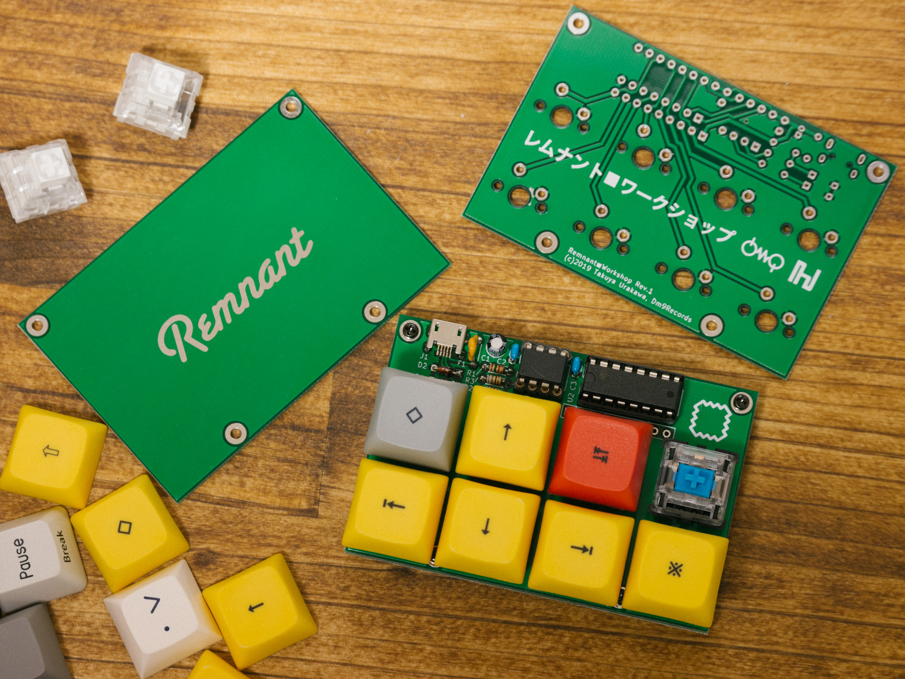

# Remnant

4x2 macro keyboard with attiny85 based digispark.

# Document
- [開発環境のインストール](doc/install_env_jp.md)
- [ビルドガイド（日本語）](doc/buildguide_jp.md)

# Needs
- Arduino IDE and Digispark
https://digistump.com/wiki/digispark/tutorials/connecting

- DigisparkKeyboardExtend library 
https://github.com/hsgw/DigisparkKeyboardExtend

# License
Digispark is licensed under CC BY-SA 3.0    http://creativecommons.org/licenses/by-sa/3.0/   
(c) Digistump   

Remnant is licensed under CC BY-SA 3.0    http://creativecommons.org/licenses/by-sa/3.0/   
(c) 2019, Takuya Urakawa, dm9records.com   

