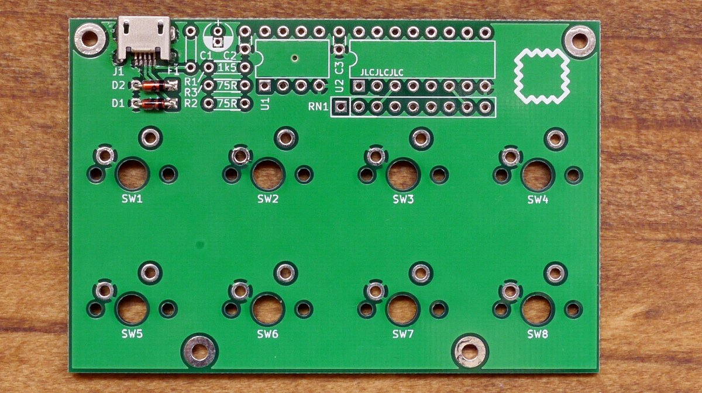
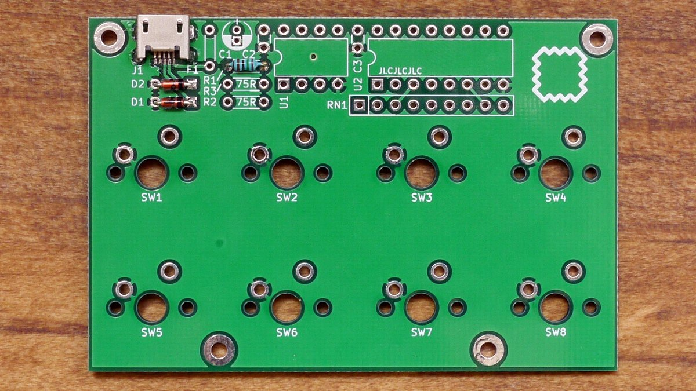
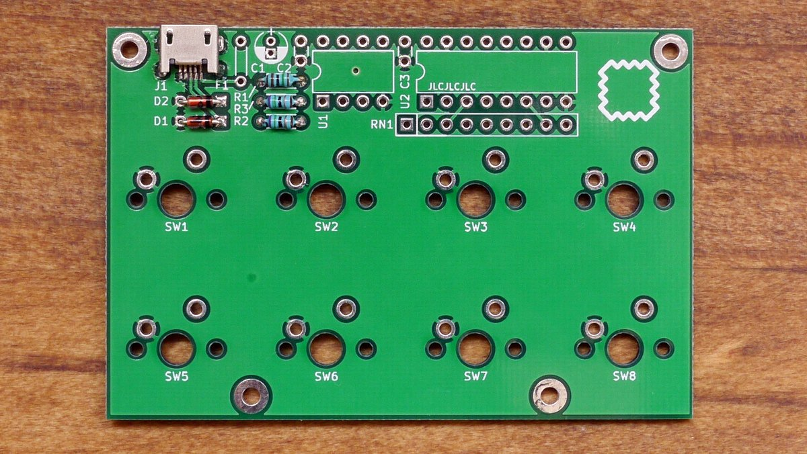
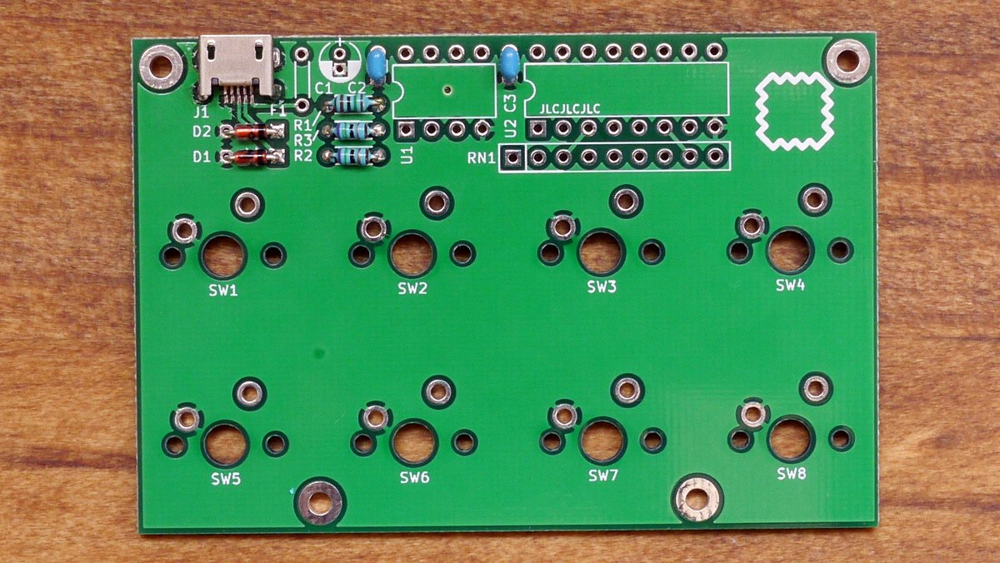
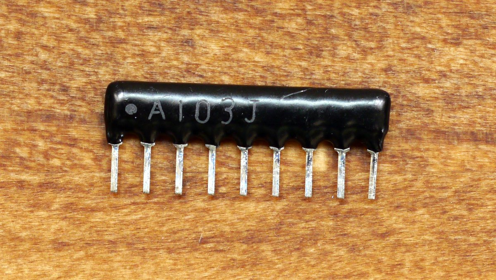
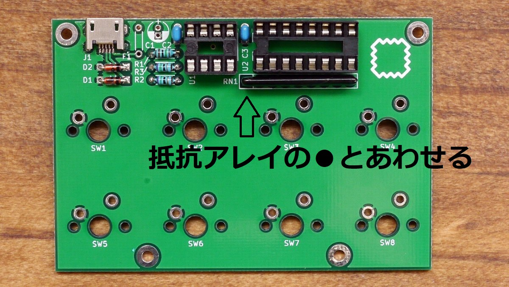
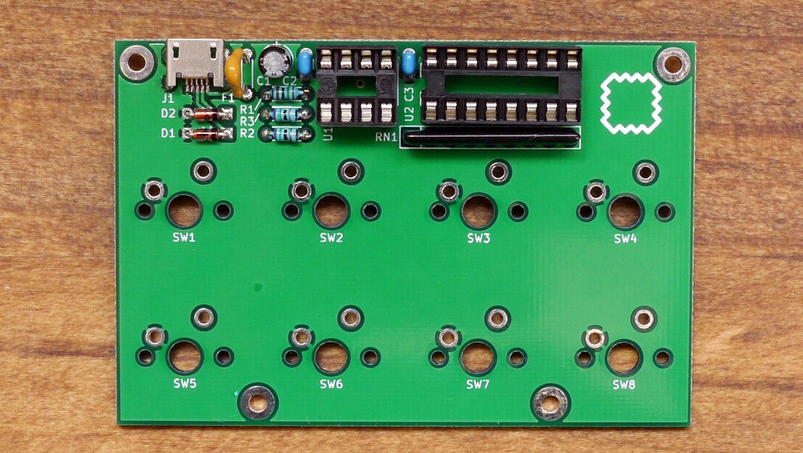
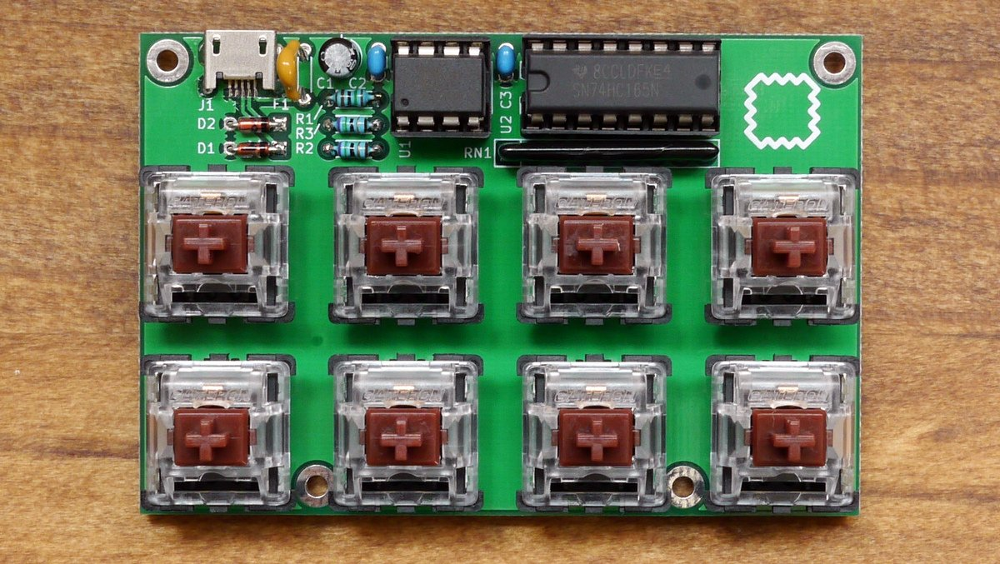

# Remnant ビルドガイド
## パーツリスト
組み立てる前にかならずパーツが全て揃っているか確認してください。

### 付属しているもの
| No           | 数量 | 説明                           |
|--------------|------|--------------------------------|
| C1           | 1    | 電解コンデンサ 4.7uF           |
| C2, C3       | 2    | 積層セラミックコンデンサ 0.1uF |
| D1, D2       | 2    | ショットキーダイオード 3.6V    |
| F1           | 1    | ポリフューズ                   |
| J1           | 1    | USB microBコネクタ             |
| R1           | 1    | 抵抗 1.5kΩ 茶緑黒茶茶          |
| R2, R3       | 2    | 抵抗 75Ω 紫緑黒金茶            |
| RN1          | 1    | 抵抗アレイ 10kΩx8              |
| U1           | 1    | マイコン attiny85              |
| U2           | 1    | ロジックIC 74HC165             |
| IC socket    | 1    | ICソケット 16ピン              |
| IC socket    | 1    | ICソケット 8ピン               |
| SW1-8        | 8    | MX互換スイッチ                 |
| キーキャップ | 8    |                                |
| PCB          | 2    | main&bottom                    |
| ねじ類       |      | 1セット                        |

### 別途必要なもの
- USB microBケーブル

## 組立

### ダイオードのはんだづけ


ダイオードには**実装する向き**があります。   
**部品の帯**と**基板シルクの線がある方**を合わせてください。

### 抵抗のはんだづけ
抵抗は2種類あります。間違えないように注意。

#### R1 (1.5kΩ)


#### R2-3 (75Ω)


### 積層セラミックコンデンサのはんだづけ
C2とC3をはんだづけします。


### 抵抗アレイとICソケットのはんだづけ
抵抗アレイには**実装する向き**があります。   
**部品上のマーキング**と**基板シルクで囲まれたピン**を合わせてください。


ICソケットには**実装する向き**があります。   
**部品の切りかけ**と**基板シルクの切りかけ**を合わせてください。



### 電解コンデンサとポリフューズのはんだづけ
電解コンデンサには**実装する向き**があります。
**部品上の帯**と**基板上のシルク**を合わせてください。
電解コンデンサの足は間隔が狭いので注意してはんだづけしてください。

ポリフューズには方向はありません。



### 動作確認
はんだづけのミス、ショートなどを目視、マルチメーターで確認したあと、
USBケーブルでPCと接続してテストを行います。
ブートローダとデフォルトキーマップはプログラムされているのでキーボードとして認識されます。

#### 認識されない場合
- はんだづけを再度確認
- 部品の方向、場所が間違えていないか
- USBケーブルを変えてみる
- PCを変えてみる

### スイッチのはんだづけ
スイッチをはんだづけします。   
しっかり奥まで取り付けられているか、まっすぐかどうかを確認してからはんだ付けしてください。



### ボトムプレートのネジ止め
上から、**ねじ**→**メイン基板**→**ナットx2**→**ボトム基板**→**ナット**の順にとりつけます。

### キーキャップをとりつけて完成

## ブートローダとファームウェアについて
### 使用する開発環境
[digispark](http://digistump.com/)互換となっているため、Arduino IDEからプログラムできます。
ブートローダに[micronucleus](https://github.com/micronucleus/micronucleus)を使用しています。

プログラムに必要なものは以下に記載していますので参考にしてください。

- [Remnantの開発環境](install_env_jp.md)

### ファームウェアについて
このリポジトリの[src](../src)内にあります。   

### キーマップのカスタマイズについて

以下の部分を書き換えることでキーマップのカスタマイズが行えます。
使えるキーコードについては[こちら](https://github.com/hsgw/DigisparkKeyboardExtend/blob/master/src/keycode.h)にあります。

```
const uint16_t PROGMEM keymap[SWITCHES_NUM] = 
  LAYOUT( 
    LCTL(KC_A), LCTRL(KC_C), KC_UP,       LCTRL(KC_V),
    KC_LSFT,    KC_LEFT,     KC_DOWN,     KC_RIGHT
  );
```
